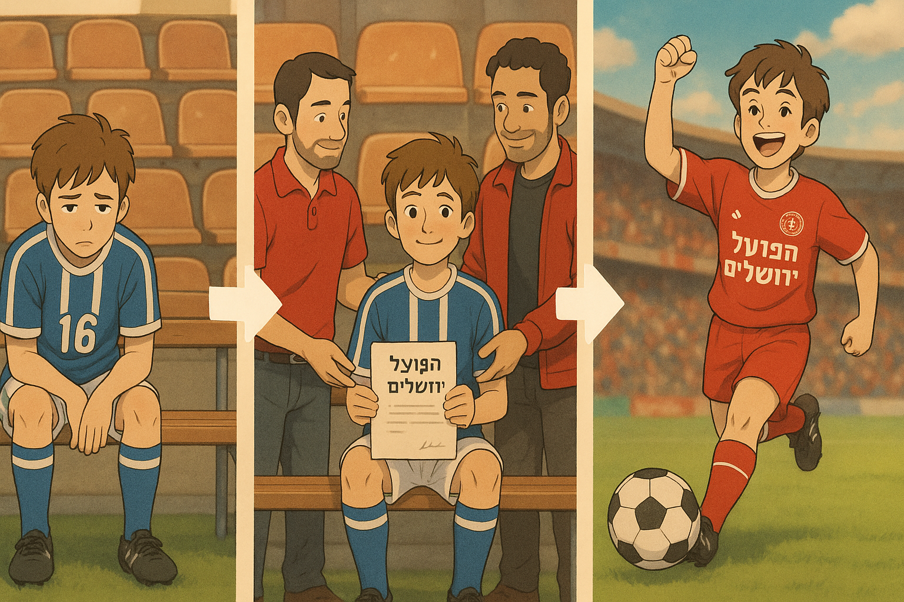

# Hapoel Jerusalem - youth scouting tool

# About the project

This project is a scouting and monitoring tool designed to assist the youth department of Hapoel Jerusalem Football Club in identifying potential player prospects.
The tool scrapes data from the Israeli Football Association website, processes youth team player statistics, and automatically generates a professional report highlighting players that meet specific criteria.

---

## Project Goals

- Scrape player data (minutes played, squad participation) from U14–U17 teams - ("Nearim A, Nearim B, Nearim C") 
- Analyze and filter players based on well-defined scouting criteria.
- Allow easy configuration via XML file.
- Build the project in a modular and maintainable way.

---

## Scouting Criteria

Players are selected if they meet each one of the following conditions:

1. **Rotation Position:**
   - Players ranked 12th to 18th in the squad based on minutes played in the season.

2. **Percentage of Minutes Played:**
   - Players who played between 25% and 50% of:
     - The minutes played by the player with the most minutes

3. **Participation in Last 3 Matches:**
   - Players who:
     - Were in the squad list for at least one of the last three matches,
     - Did not start in any of these matches (no appearances in starting lineup),
     - Played no more than 90 minutes in total across these matches.

